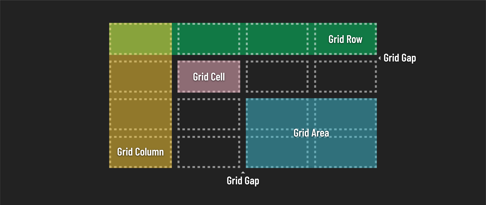

<h1>
  CSS Grid
  Concepts
</h1>

**Learning objective:** By the end of this lesson, students will understand CSS Grid as a versatile layout tool, capable of handling complex web designs with multi-column layouts, responsive design, and interactive UI components.

## The revolution of CSS Grid

CSS Grid emerged as a game-changer in web design, offering a two-dimensional system for precise element alignment and layout control. It replaced older, less flexible methods like [floats](https://developer.mozilla.org/en-US/docs/Web/CSS/float) and [positioning](https://developer.mozilla.org/en-US/docs/Learn/CSS/CSS_layout/Positioning), revolutionizing web page layouts.

## Why choose CSS Grid?

 - **Ease of use:** Grid's straightforward syntax simplifies layout creation. 
 - **Responsive design:** Easily adapt layouts for different screens using media queries.
 - **Accessibility:** Pairing Grid with semantic HTML enhances user accessibility.
 - **Clean code:** Grid reduces code complexity and increases maintainability.
 - **Versatile layouts:** From multi-column to complex structures, Grid handles it all.

 

 

## Ideal use cases for CSS Grid

 - **Multi-column layouts:** Effortlessly create layouts with multiple columns and sidebars.
 - **Complex page structures:** Manage intricate designs, nested grids, and dynamic content.
 - **Responsive websites:** Build layouts that fluidly adjust to various screen sizes.
 - **Interactive UI components:** Ideal for menus, modals, and carousels.
 - **Controlled white space:** Maintain consistent spacing and dedicated blank areas with grid gap. 

 Let's dive in! 
