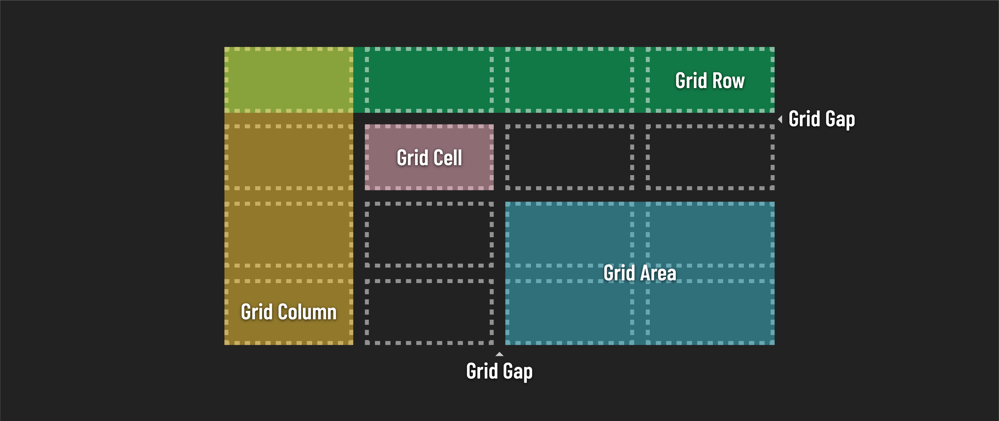

# 

**Learning objective:** By the end of this lesson, students will understand CSS Grid as a versatile layout tool, capable of handling complex web designs with multi-column layouts, responsive design, and interactive UI components.

## The Revolution of CSS Grid

CSS Grid emerged as a game-changer in web design, offering a two-dimensional system for precise element alignment and layout control. It replaced older, less flexible methods like [floats](https://developer.mozilla.org/en-US/docs/Web/CSS/float) and [positioning](https://developer.mozilla.org/en-US/docs/Learn/CSS/CSS_layout/Positioning), revolutionizing web page layouts.

## Why Choose CSS Grid?

 - **Ease of Use:** Grid's straightforward syntax simplifies layout creation.
Responsive 
 - **Design:** Easily adapt layouts for different screens using media queries.
 - **Accessibility:** Pairing Grid with semantic HTML enhances user accessibility.
 - **Clean Code:** Grid reduces code complexity and increases maintainability.
 - **Versatile Layouts:** From multi-column to complex structures, Grid handles it all.

 

 

## Ideal Use Cases for CSS Grid

 - **Multi-Column Layouts:** Effortlessly create layouts with multiple columns and sidebars.
 - **Complex Page Structures:** Manage intricate designs, nested grids, and dynamic content.
 - **Responsive Websites:** Build layouts that fluidly adjust to various screen sizes.
 - **Interactive UI Components:** Ideal for menus, modals, and carousels.
 - **Controlled White Space:** Maintain consistent spacing and dedicated blank areas with grid gap. 

 Let's dive in! 
