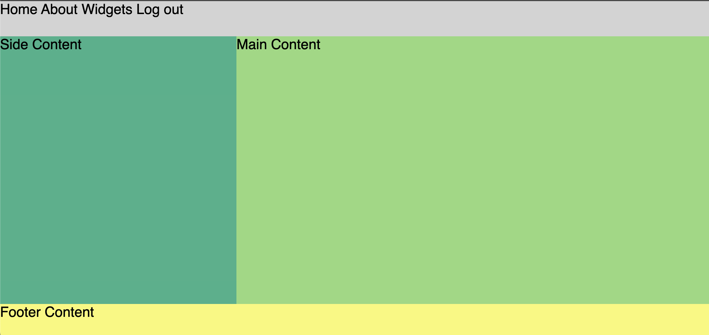
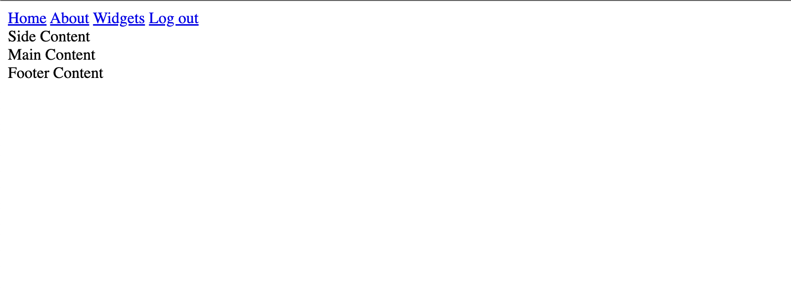
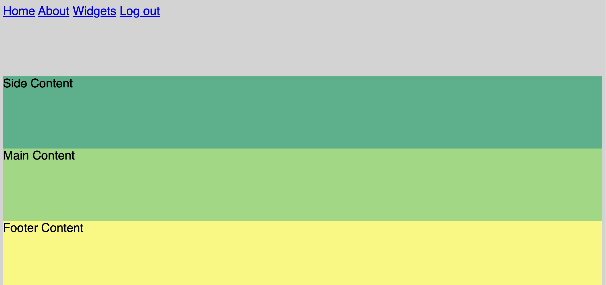
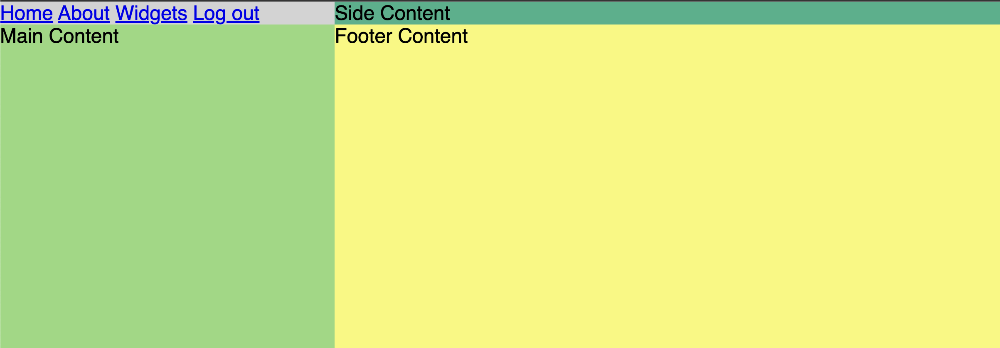
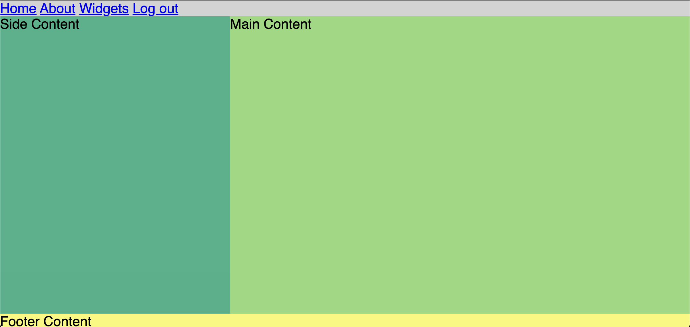

<h1>
  <span class="headline">CSS Grid</span>
  <span class="subhead">Fundamentals</span>
</h1>

**Learning objective:** By the end of this lesson, students will implement a full page layout using css grid properties. 

## Grid basics

Grids are made of up of several components:
- **Tracks (Rows and Columns)**
  - **Rows**: Horizontal tracks of the grid. Their size can be defined using `grid-template-rows`.
  - **Columns:** Vertical tracks of the grid. Their size is set with `grid-template-columns`.
- **Cells** - The intersection of a grid row and a grid column, akin to a cell in a table. Each cell is a single unit of the grid where you can place your content
- **Areas** - A grid area is a rectangular space created by combining one or more cells
- **Gaps** - The spaces between rows and columns, previously known as 'gutters'.

This diagram is helpful for visualizing the role each of these components plays:


To read more in depth about grid components and get a detailed user guide, check out [the Complete Guide to CSS Grid from CSS Tricks](https://css-tricks.com/snippets/css/complete-guide-grid/).


## Implementing a sample design

Let's start exploring CSS Grid by building a mock website layout. This is a great way to see how it works in a real-world example. We'll put together a straightforward page layout that really shows off what CSS Grid can do.

By the end of this lesson, we'll create a generic (yet common) website layout:



## Start with page structure

Creating a layout starts with the physical structure of your page - the HTML. 

We'll start with some basic components of a website - header, footer, and something in the middle. 

Add the following starter code inside of the `<body>` tag of your HTML:

```html
<body>
  <nav class="nav-links">
    <a href="#">Home</a>
    <a href="#">About</a>
    <a href="#">Widgets</a>
    <a href="#">Log out</a>
  </nav>
  <aside>Side Content</aside>
  <main>Main Content</main>
  <footer>Footer Content</footer>
</body>
```

> Take a moment to open your page in the browser. Without any css to alter their positioning, these elements behave exactly like we'd expect block level elements to behave.



## Creating your first grid

The foundation of any CSS Grid layout is the **grid container**, an HTML element that serves as the parent for all grid items within.

To create our grid container, we'll need to:

1. **Identify the container element:** Begin by selecting an HTML element that will act as the container for your grid. This element will hold all the grid items. Given our current HTML structure, the `body` element is the most logical choice.

2. **Apply the display property:**  To apply our grid style to the container, we'll add the `display: grid;` property to the `body` element. This step transforms the element into a `grid container`, and affects the positioning behavior of the child elements. 

Create your grid by adding the following code into `css/style.css`:

```css
body {
  display: grid;
}
```

Great! This code turns our `<body>` element into a **grid container**, but when we check the browser, everything looks the same?
Until we give our grid more instructions about *how* our sections should be laid out, our page structure looks the same.

Let's add a few  *non grid* styles to define the overall look of our page first. 

```css
body {
  background-color: lightgray;
  display: grid;
  font-family: sans-serif;
  font-size: 24px;
  min-height: 100vh;
}
```

These styles add a  light gray background, sans-serif font, and ensures that the body element stretches to at least the full height of the viewport. 


> `min-height: 100vh` Sets the minimum height of the `<body>` to 100% of the viewport height (vh stands for viewport height). This ensures that the body takes up at least the full height of the screen, regardless of the amount of content. When we apply this, the page allocates equal space to all the vertical elements. This tells our grid layout to fill all available space in the browser window.

Now to add a bit of differentiating style to the individual page sections. Add the following to your `css/style.css` file:

```css
aside {
  background-color: #38b18a;
}

main {
  background-color: #92d97c;
}

footer {
  background-color: #f9f871;
}
```

Check your work in the browser:



Why the extra gray around the edges? 

### Remove browser defaults

Browsers often set default styles for certain elements, including margins and padding on elements such as `headers` and `divs`. In this case the browser is adding some default margin to the `body` element, causing this extra stripe of gray around the pages edge. To gain complete control over our layout's margins and padding, let's reset these default styles.

```css
body {
  background-color: lightgray;
  display: grid;
  font-family: sans-serif;
  font-size: 24px;
  min-height: 100vh;
  /* Add the following */
  margin: 0;
  padding: 0;
}
```

No more extra margin!

## Set grid properties

Time to define the columns and rows necessary to bring our layout to life.

Take a look at our design example again:


Considering the layout above: 

- How many horizontal **rows** do we need to define?
- How many vertical **columns** do we need to define?

If you said **3 rows** and **2 columns**, you are correct! 

We'll use the CSS properties `grid-template-columns` and `grid-template-rows` to define the size and number of columns and rows in our grid.

Add the following lines to our existing `body` rule in `css/style.css`:

```css
body {
  background-color: lightgray;
  display: grid;
  /* Add the following */
  grid-template-rows: auto 1fr auto; /* three rows defined here */
  grid-template-columns: 1fr 2fr; /* two columns defined here */
  font-family: sans-serif;
  font-size: 24px;
  min-height: 100vh;
  margin: 0;
  padding: 0;
}
```

Let's unpack what is happening here:

`grid-template-rows: auto 1fr auto;`

- This property defines the height of the rows in the grid.
- `auto`: The first and third rows will automatically adjust their height based on the content they contain. The row height will be as tall as the content needs it to be, no more and no less.
- `1fr`: The second row will be flexible and take up the remaining space in the grid container. 


`grid-template-columns: 1fr 2fr;`

- This property defines the width of the columns in the grid.
- `1fr`: The first column will take up one fraction of the available space in the grid container.
- `2fr`: The second column will take up twice the amount of space as the first column, in other words, two fractions of the available space.
- Together, these two values divide the grid container's horizontal space into two columns with the specified width proportions.


>  The `fr` unit in CSS Grid is a flexible and relative length unit used to define the size of columns and rows within a grid layout. It stands for "fraction" and represents a fraction of the available space in the grid container. 

Take a look at the output after our changes. Not exactly what we were hoping for:



If you think about a grid with 3 rows and 2 columns, you're probably picturing something like this: 

|1|2|
|-|-|
|3|4|
|5|6|

There are six spaces, but we only have 4 sections in our page, so grid will try and figure out the layout that we want based on this limited information. 

By default, it gives each section one cell from left to right and omits the bottom row because it isn't in use.


## Spanning multiple rows and cols

In our design example the `nav`, and `footer` sections are meant to go all the way across the screen, spanning the width of both columns in the layout. 

Let’s make both the `<nav>` and the `<footer>` span two columns each.

There are several ways to accomplish this using the `grid-column` CSS property. Here are the two most common.

  - **Spanning Multiple Columns**: Use `grid-column: span X;` to stretch a grid item across `X` number of columns. For example, `grid-column: span 2`; makes an item cover two columns.

  - **Starting and Ending Lines**: Specify starting and ending column lines with `grid-column: start / end;`. For instance, `grid-column: 1 / 3;` stretches the item from the first to the third column line, spanning two columns.

Let's add the following directly to the `nav` and `footer` elements:

```css
nav, 
footer {
  grid-column: span 2;
}
```

We can achieve the same result with `start / end` using gide lines:

```css
nav, 
footer {
  grid-column: 1 / 3;
}
```

That's more like it! 




Unsurprisingly, there’s also a `grid-row` property which allows you to specify the same behavior for grid cells spanning across rows. 

Now that our page sections are in their proper positions, we can add a few extra styles to give the `nav` and `footer` some extra height. 


```css 
nav, 
footer {
  grid-column: span 2;
  height: 60px;
}

a {
  text-decoration: none; /*  remove default underline */
  color: black; 
}
```

Check your final output: 


Great job! You've just created your first grid layout!