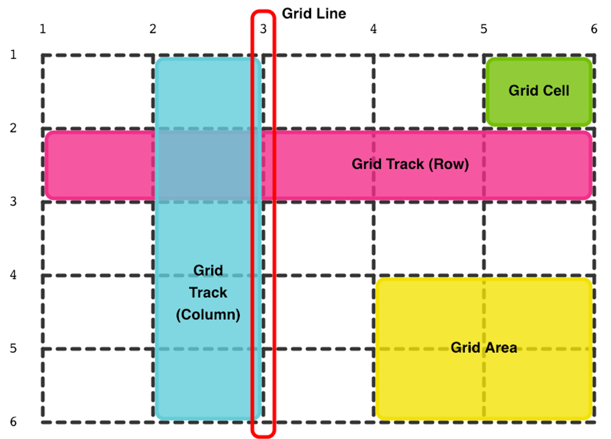
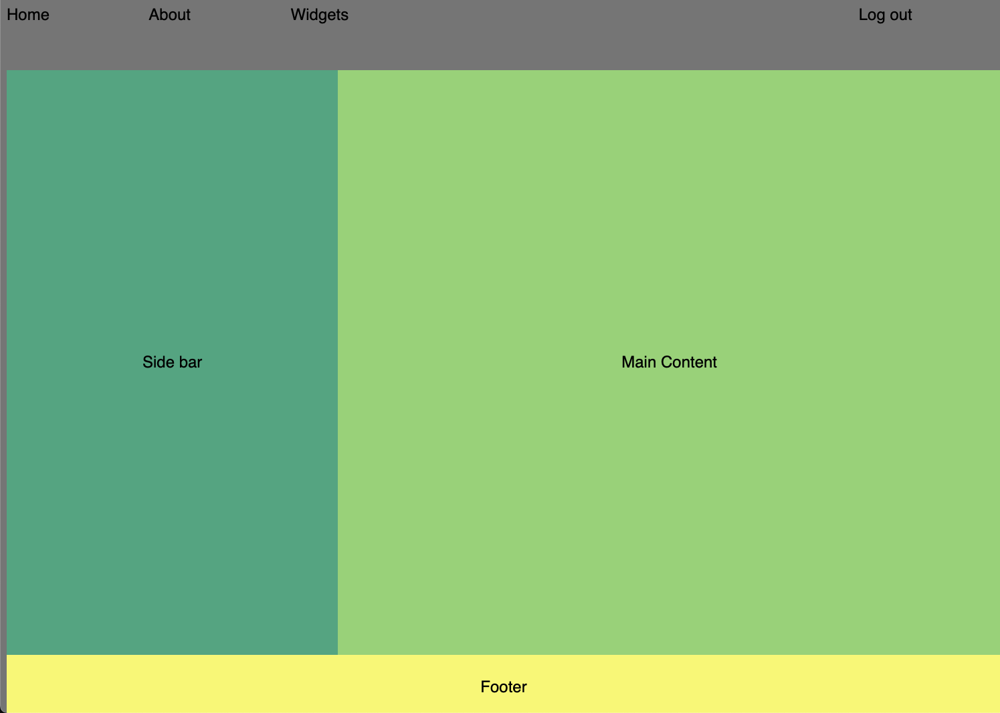
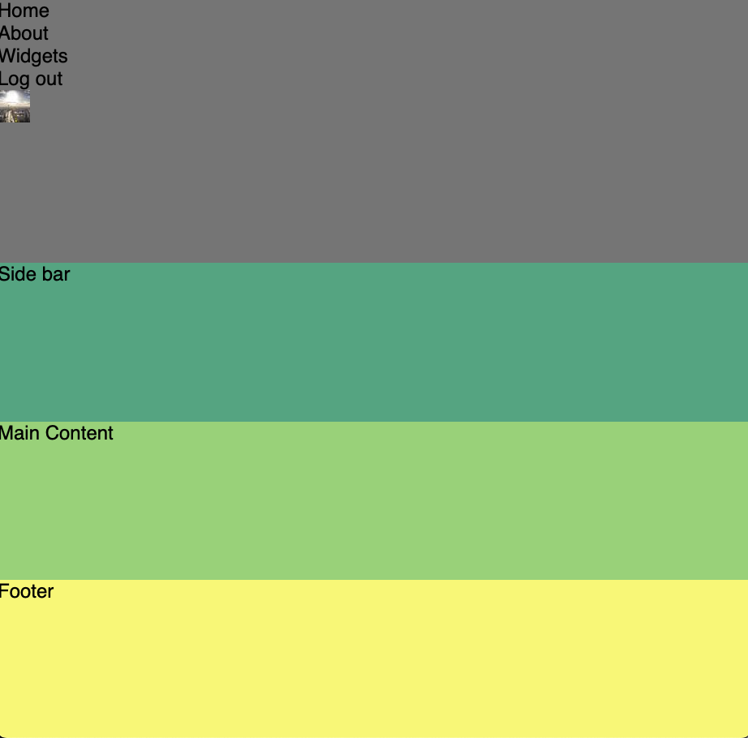
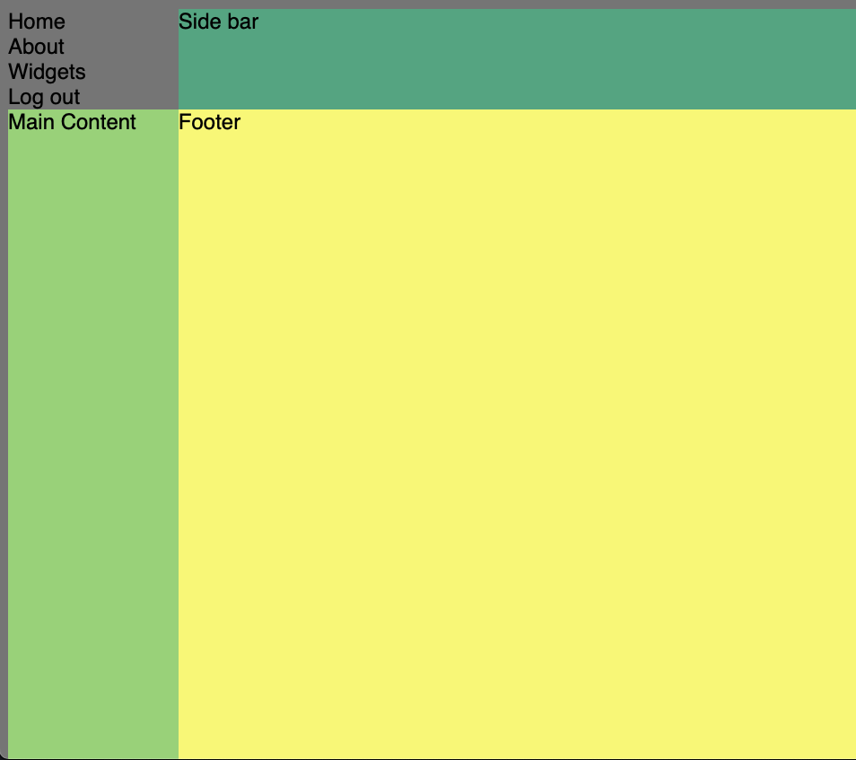
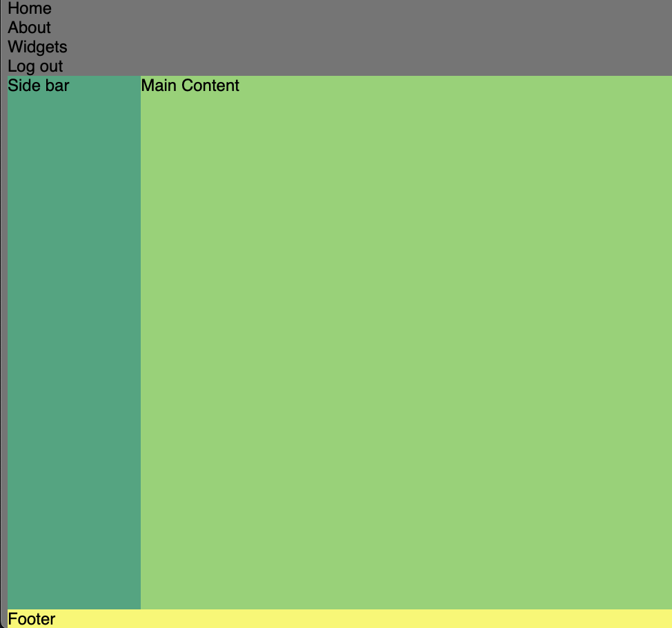
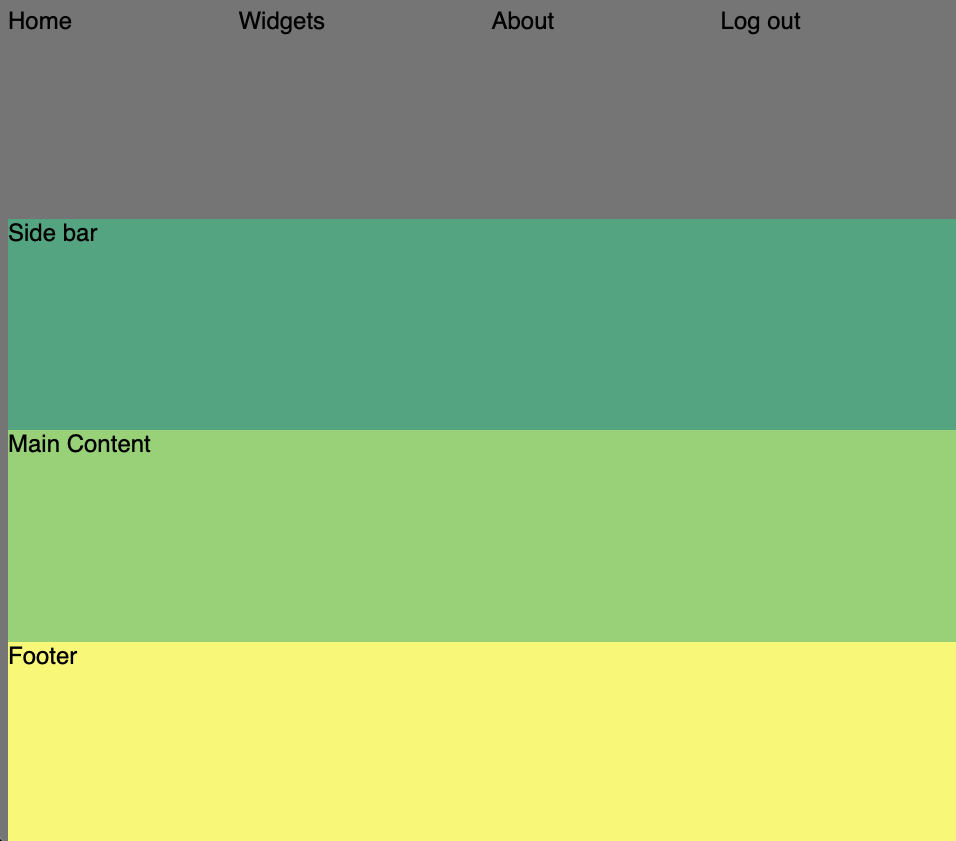
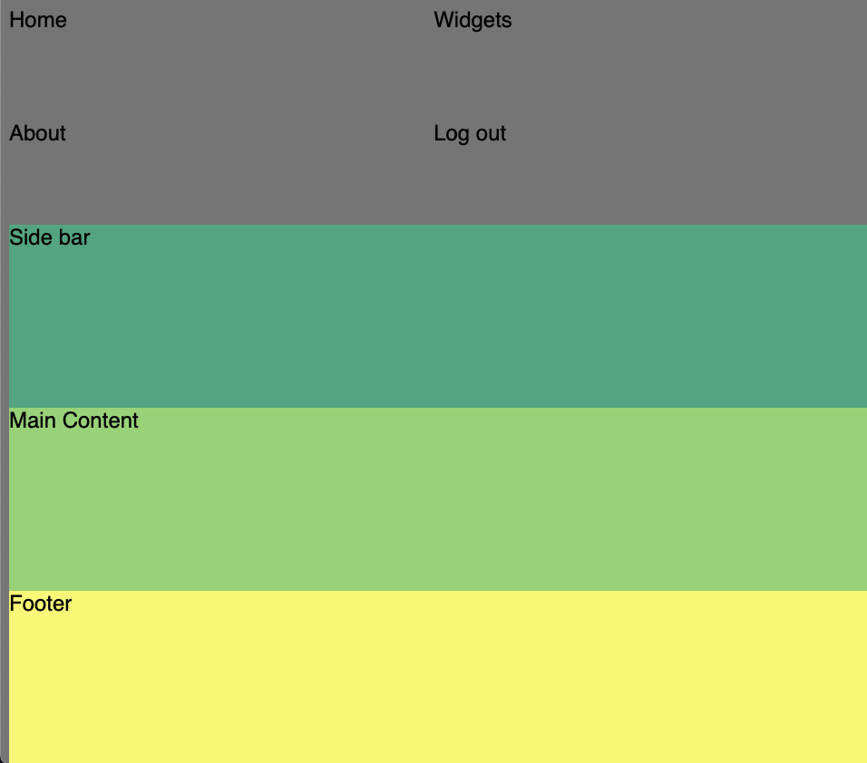

# Grid - Fundamentals


**Learning objective:** By the end of this lesson, students will explore the core principles of CSS Grid, including grid creation, item placement, auto-placement, and visual grid areas.

## Grid basics

Grids are made of up of several components:
- **Tracks (columns)**
- **Cells**
- **Areas**
- **Gaps**

This diagram is helpful for visualizing the role each of these components plays:



To read more in depth about grid and its various properties, check out [the Complete Guide to CSS Grid from CSS Tricks](https://css-tricks.com/snippets/css/complete-guide-grid/).

## Creating a grid

The foundation of any CSS Grid layout is the **grid container**, an HTML element that serves as the parent for all grid items within. To define a grid container, we use the `display:grid` property on the desired element in our CSS. This transforms the element into a grid layout system, and enables us to place grid items within its structure. 

Let's make our first grid! By the end of this lesson, we'll create something that looks like this:



In `index.html`, stub up your boilerplate and link to our CSS file:

```html
<link rel="stylesheet" href="./css/style.css" />
```

Now, add the following code inside of the `<body>` tag:

```html
<body>
  <nav class="nav-links">
    <div>Home</div>
    <div>About</div>
    <div>Widgets</div>
    <div>Log out</div>
  </nav>
  <aside>Side bar</aside>
  <main>Main Content</main>
  <footer>Footer</footer>
</body>
```

And add this code into `css/style.css`:

```css
body {
  background-color: gray;
  display: grid;
  font-family: sans-serif;
	font-size: 24px;
	margin: 0;
  padding: 10px;
  min-height: 100vh;
}
```
This code turns our `<body>` element into a **grid container**. Using `min-heigh: 100vh` makes the `<body>` fill at least the height of the browser window. 

Now to add a bit of style. Let's go ahead and change the color of some of the HTML elements we added. In your `css/style.css` file, add this code:

```css
aside {
  background-color: #38b18a;
}

main {
  background-color: #92d97c;
}

footer {
  background-color: #f9f871;
}
```

Right now, we should have something that looks like this:


## Placing grid items
Time to define the columns and rows necessary to bring our layout to life. Go back to the UI we want to design, and answer these questions:
- **How many columns will we need to define?**
- **How many rows?**

Now, add these lines to our existing `body` rule in `css/style.css`:
```css
grid-template-columns: 20% 80%;
grid-template-rows: auto 1fr auto;
```

The `fr` unit is used by CSS Grid to represent a *fraction* of the available space. In our layout, the first column will be 1/5th the width of the window. The auto unit will let the content in that row determine the size of that row.

Our output is a bit of a mess right now:



Notice the default behavior - each grid item gets placed in each cell across the columns from left to right. Next, let’s make both the <nav> and the <footer> span two columns each.

To do this, we'll use the `grid-column` CSS property, which determines which **grid lines** a **grid item** starts and ends on. 

Add this css:

```css
nav, 
footer {
  grid-column: 1 / 3;
}
```

Now we're making some progress!


We can achieve the same result with `span`, like so:
```css
nav, 
footer {
  grid-column: span 2;
}
```

Unsurprisingly, there’s a `grid-row` property as well. Both `grid-column` & `grid-row` are shorthand for `grid-column-start` & `grid-column-end`, and `grid-row-start` & `grid-row-end`, respectively.

Now that the `footer` element is on a row by itself, we can give it a height. Create a standalone `footer` rule and add this line to it: `height: 40px;`

The `auto` value we gave to this row when we wrote our `grid-template-row` declaration means that this row will now expand to be 40px tall. The total height of our body is still `100vh` - so the middle row, which has a value of `1fr`, will shrink to accommodate the footer’s new size.


## Autoplacement
CSS Grid offers automatic placement, simplifying layout creation by automatically positioning grid items. The `grid-auto-flow` property controls the direction of automatic placement, with options like `row` and `column`. Use `grid-auto-rows` and `grid-auto-columns` to define the size of automatically generated rows and columns.


## `grid-template-area`
If we want a more intuitive approach to layout creation, we can use `grid-template-area`, which helps define visal grid areas. To do this, we use area names, and dictate where they should be positioned in our grid.

Let's style the navbar with `grid-template-area`. Add the following code to `css/style.css`:

```css
.nav-links {
  display: grid;
  list-style: none;
  margin: 0;
  padding: 0;
  grid-template-areas: "home widgets about logout";
  grid-gap: 10px;
}

.nav-links div:nth-child(1) { grid-area: home; }
.nav-links div:nth-child(2) { grid-area: about; }
.nav-links div:nth-child(3) { grid-area: widgets; }
.nav-links div:nth-child(4) { grid-area: logout; }
```
This code allows us to layout our navbar as a horizontal row. 



But we could do even more with it if we wanted to. Watch what happens when we make the following change to our css:

```css
.nav-links {
  display: grid;
  list-style: none;
  margin: 0;
  padding: 0;
  grid-template-areas: 
   "home widgets"
   "about logout";
  grid-gap: 10px;
}
```



Pretty neat, right? Let's go ahead and change it back into a horizontal row:

```css
.nav-links {
  display: grid;
  list-style: none;
  margin: 0;
  padding: 0;
  grid-template-areas: "home widgets about logout";
  grid-gap: 10px;
}
```

We can also use `grid-template-area` to easily place all of our elements correctly. To do this, we're going to replace some of the CSS we wrote above:

```css
body {
  background-color: gray;
  display: grid;
  font-family: sans-serif;
  font-size: 24px;
  margin: 0;
  padding: 10px;
  min-height: 100vh;
  grid-template-columns: 1fr 1fr 1fr; 
  grid-template-rows: 0.5fr 1.5fr 3fr 0.5fr;
  grid-template-areas: 
    "nav nav nav"
    "aside main main"
    "aside main main"
    "footer footer footer"; 
}

aside {
  background-color: #38b18a;
  grid-area: aside;
}

main {
  background-color: #92d97c;
  grid-area: main;
}

footer {
  background-color: #f9f871;
}

nav {
  grid-area: nav;
}

footer {
  grid-area: footer;
}
```
Note how we defined the amount of space we want each row to take up by using different `fr` values. 

We're almost there! We just need to tweak our `.nav-links` CSS a bit and we'll be good to go!

```css
.nav-links {
  display: grid;
  list-style: none;
  margin: 0;
  padding: 0;
  grid-template-columns: 1fr 1fr 1fr 1fr 1fr 1fr 1fr; 
  grid-template-rows: 1fr; 
  grid-gap: 0px; 
  grid-template-areas: 
    "home about widgets . . . logout";
  grid-area: nav;
}
```

Lastly, let's make a stylistic change by creating a class that will center the text of our elements. Add this to your CSS file:

```css
.flex-container {
  display: flex;
  align-items: center;
	justify-content: center;
}
```

With that class created in our CSS, we can add it to our semantic HTML elements `<aside>`, `<main>`, & `<footer>`. 

Ta-da! We just created our first grid layout!