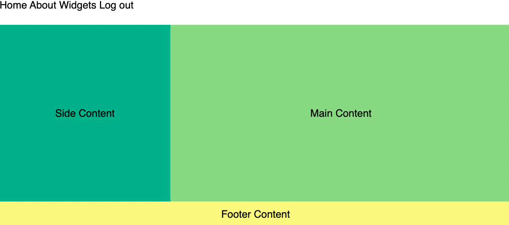

<h1>
  <span class="headline">CSS Grid</span>
  <span class="subhead">Grid Template Areas</span>
</h1>

`grid-template-areas` allows us to create a grid layout in a more intuitive way. First, you assign area names to the `html` elements you want to control your grid. Then you create a "map" of these items using the `grid-template-areas` property on your grid container.

```css
body {
  display: grid;
  font-family: sans-serif;
  font-size: 24px;
  grid-template-rows: auto 1fr auto;
  grid-template-columns: 1fr 2fr; 
  grid-template-areas: 
    "nav nav nav"  /* <- place area names in rows and cols as you want them displayed */
    "aside main main"
    "footer footer footer"; 
  min-height: 100vh;
  margin: 0;
  padding: 0;
}
```

Notice how the structure of the named areas in `grid-template-areas` looks like a mini version of our page layout in our CSS. For this reason, some people find it easier to use `grid-template-areas` because you can "visualize" the grid in your CSS as you create it.

If you want to test out this alternate syntax, you can replace all of your existing CSS with the following:

```css
body {
  display: grid;
  font-family: sans-serif;
  font-size: 24px;
  grid-template-rows: auto 1fr auto;
  grid-template-columns: 1fr 2fr; 
  grid-template-areas: 
    "nav nav nav"
    "aside main main"
    "footer footer footer"; 
  min-height: 100vh;
  margin: 0;
  padding: 0;
}

aside {
  background-color: #38b18a;
  grid-area: aside; /* name of area */
}

main {
  background-color: #92d97c;
  grid-area: main; /* name of area */
}

nav {
  grid-area: nav; /* name of area */
}

footer {
  background-color: #f9f871;
  grid-area: footer; /* name of area */
}

footer, nav {
  min-height: 60px
}

a {
  text-decoration: none;
  color: black;
}
```

> **Naming Tip:** In the example above we've chosen to use the semantic HTML tag name as the grid template area name. However, you can name grid template areas just as you would any variable. We could have just as easily called these "section1", "section2", "section3" or more descriptively "featured-article", "trending-topics", or "advertisement". 


## Flexbox + Grid

Flexbox can be effectively used within CSS Grid cells to center items. While Grid arranges the overall layout, Flexbox excels in aligning and centering content inside Grid cells. This combination offers precise control, making layouts both flexible and visually balanced.

Let's make a stylistic change by creating a class that will center the text of our elements. Add this to your CSS file:

```css
.flex-container {
  display: flex;
  align-items: center;
  justify-content: center;
}
```

Now add the class `flex-container` to the semantic HTML elements `<aside>`, `<main>`, & `<footer>`. 



Ta-da! You now know two ways to structure a grid layout!